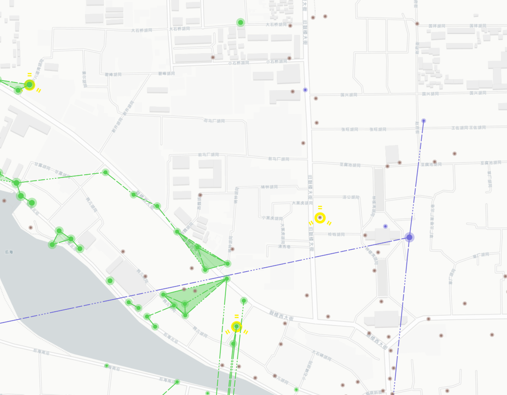

# IITC Alternative Style plugin

This plugin basically just changes the style of portals in IITC.

It patches a specific function that defines the style of portals:
https://github.com/IITC-CE/ingress-intel-total-conversion/blob/b75faf1972d2713f02ff89c8724309205c15b8b0/core/code/portal_marker.js#L43

## Screenshot



## Install

Click "Add external plugin" in your IITC and paste the following link:

```
https://github.com/lynzrand/iitc-alternative-style/raw/master/plugin.user.js
```
